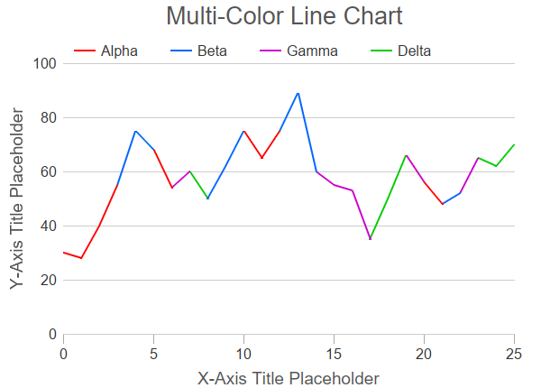

# Welcome to My Portfolio  

Hello! I’m Robinson, a biochemist and data scientist with experience in AI-driven solutions for sustainability, predictive modeling, and data analysis. This portfolio highlights my key projects and achievements.

---

## About Me  
- **Expertise:** Biochemistry, Data Science, Machine Learning  
- **Key Skills:** Python, Data Analysis, Machine Learning Modeling, GitHub, Google Colab  
- **Focus Areas:**  
  - AI-driven solutions for sustainable development  
  - Nutritional analysis and insect meal optimization  
  - File processing for custom data insights  

---

## Projects  

<!-- Project 1 -->

  <h3><a href="./project1.md">Insect Meal Composition Prediction</a></h3>
  
  
<strong>Description:</strong> Developed a machine learning model to predict the nutritional composition of insect meal based on feeding conditions and diet.

  
<strong>Skills Used:</strong> Python, Machine Learning, Data Visualization

<!-- Project 2 -->

  <h3><a href="./project2.md">EDF File Analysis and Event Detection</a></h3>
  
  
<strong>Description:</strong> Processed and analyzed EDF+ files, extracting relevant events for biological studies.

  
<strong>Skills Used:</strong> Python, Pandas, Signal Analysis

---

## Contact  
Feel free to connect with me for collaborations or inquiries:  
- **Email:** [email@email.com]  
- **LinkedIn:** [LinkedIn Profile](#)  
- **GitHub:** [RobinsonArceM](https://github.com/RobinsonArceM)  

---

Thanks for visiting! 🚀  
