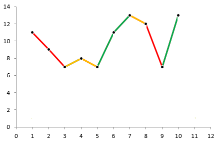

# Welcome to My Portfolio  

Hello! I’m Robinson, a Data Scientist with a PhD in Cellular and Molecular Biology. I combine rigorous scientific training with expertise in Python, AI, and machine learning, gained through academic research and startup experience. This portfolio showcases my projects in AI-driven sustainability, predictive modeling, and data analysis.

---

## About Me  
My journey combines deep scientific investigation with cutting-edge data science. Holding a PhD in Cellular and Molecular Biology, I developed expertise in areas like fluorescence microscopy and energy metabolism. This rigorous research foundation now fuels my work as a Data Scientist.

**Transition & Experience:** Gained practical experience applying Python, AI, and machine learning in a startup environment, focusing on the development of a model that allows to predict the optimal combination of organic waste to feed Black Soldier Fly larvae and produce high quality protein for animal feed. 
 
**Technical Skills:** Python (Pandas, Scikit-learn, Streamlit), Machine Learning, Data Analysis & Visualization, AI Implementation, Google Colab, Biopython, Alphafold and Pymol. 
 
**Scientific Expertise:** Biochemistry, Cellular/Molecular Biology, Fluorescence Microscopy, Energy Metabolism, Fluorescent Nanosensors, Mathematical modelling. 
 
**Current Focus Areas:**  
- Applying AI and predictive modeling for sustainable development.
- Developing custom data processing and insight generation pipelines.
- Seeking opportunities where I can leverage both my scientific background and data science skills.

---

## Projects  

<!-- Project 1 -->

  <h3><a href="./project1">Insect meal optimization with ML</a></h3>
  
  
<strong>Description:</strong> Developed a machine learning model to predict the nutritional composition of insect meal based on feeding conditions and diet.

  
<strong>Skills Used:</strong> Python, Machine Learning, Streamlit

<!-- Project 2 -->

  <h3><a href="./project2">EDF File Analysis and Event Detection</a></h3>
  
  
<strong>Description:</strong> Processed and analyzed EDF+ files, extracting relevant events for biological studies.

  
<strong>Skills Used:</strong> Python, Pandas, Signal Analysis

---

## Contact  
Feel free to connect with me for collaborations, inquiries or any idea you want to discuss:
- **Email:**: arcebq@gmail.com
- **LinkedIn:** [Robinson Arce Molina](https://www.linkedin.com/in/robinson-arce-molina-4566208b/)  

---

