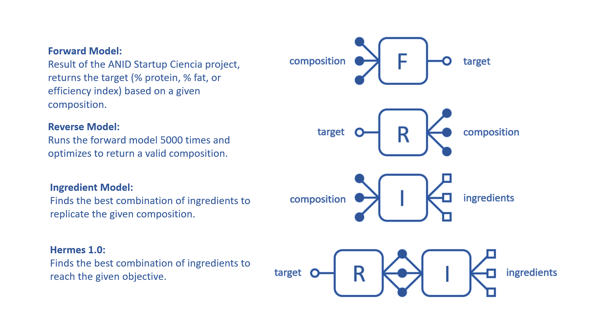
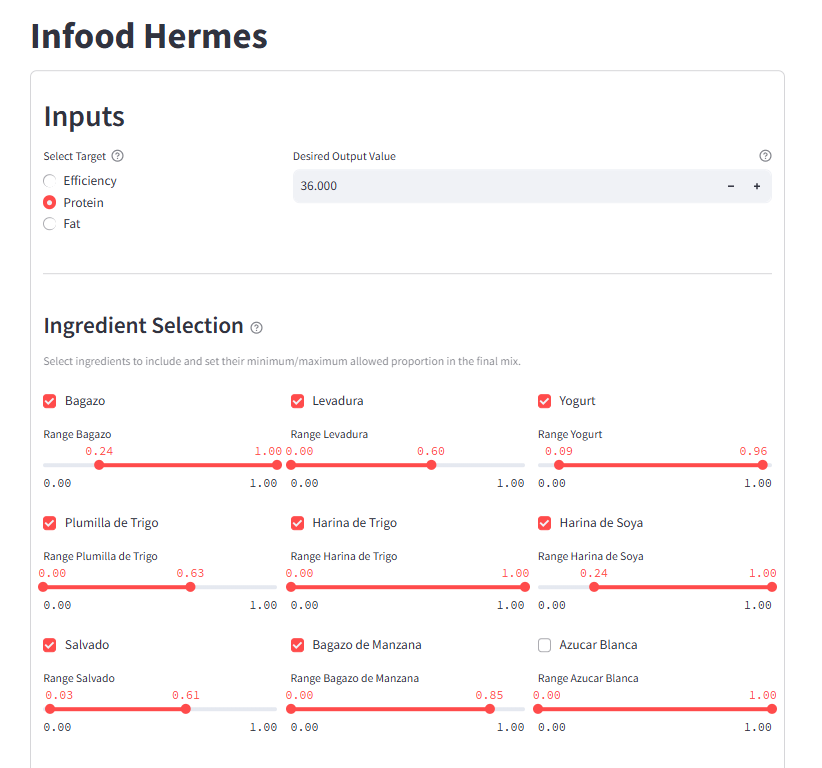
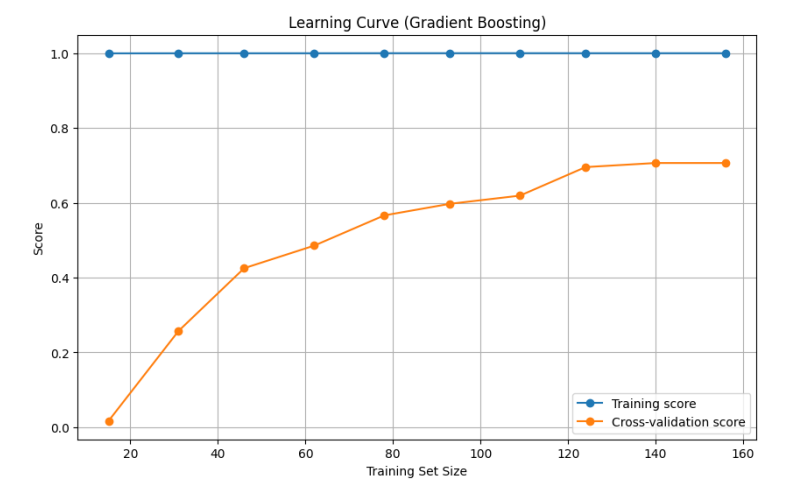

# HERMES: Predicting and Optimizing Insect Meal Composition

## Summary

Developed HERMES, a machine learning system funded by ANID's Startup Ciencia program for Infood Protein. HERMES predicts the nutritional composition (protein %, fat %, efficiency index) of Black Soldier Fly larvae meal based on diet and environmental conditions using three Gradient Boosting models. This allows the system not only to predict outcomes but also, through a reverse optimization engine, to find the inputs needed determine the optimal ingredient mix and conditions required to achieve specific target nutritional profiles, enabling data-driven production for sustainable animal feed.

## Problem & Goal

Infood Protein aims to produce high-quality, sustainable insect-based protein for animal feed. However, the final nutritional composition of the Black Soldier Fly larvae meal can vary significantly depending on the larvae's diet and rearing conditions. Predicting and controlling this composition is crucial for consistent product quality and efficient resource utilization.

The goal of the HERMES project, supported by Startup Ciencia, was to:
1.  Develop accurate machine learning models to **predict** the final meal composition (protein %, fat %, efficiency) based on known inputs.
2.  Create an optimization system to **determine the optimal diet composition and environmental parameters** needed to achieve desired target nutritional profiles.

## My Role

As the Director and lead Data Scientist on this project, I was responsible for the design of diets and feeding conditions of the larvae and end-to-end development of the HERMES system, including data analysis, model training, validation, and the implementation of the prediction and optimization components within a functional application.

## Approach & Methodology

The HERMES system consists of several interconnected modules, trained on data from ~200 experimental diets:

System architecture of HERMES, showing the forward prediction, reverse optimization, and ingredient solver components.
    ```html
    
    <p style="text-align: center; font-style: italic;">System architecture of HERMES</p>
    ```

* **Data:** Utilized experimental data encompassing ~200 different diet formulations fed to Black Soldier Fly larvae. Diets were generated as sparse as possible in a 7-dimensional nutrient space using a Python implementation of a maximin optimizer.
    * **Input Features:** Included dietary nutritional components (protein, fiber, ashes, sugar, etc), and environmental variables (temperature, humidity, diet pH, etc).
    * **Target Variables:** Protein Percentage (%), Fat Percentage (%), and a calculated Efficiency Index.
* **Forward Model (Prediction):**
    * Implemented three parallel Gradient Boosting Regressor models, one for each target variable (protein, fat, efficiency).
    * Standard preprocessing steps like feature scaling were applied.
* **Reverse Model (Composition Optimization):**
    * To find the optimal composition and environmental parameters for a *given target output*, the system runs the trained forward models ~5000 times with varying inputs.
    * The best results from these runs are then refined using optimization techniques (scipy.optimize) to pinpoint a valid set of input conditions.
* **Ingredients Model (Diet Solver):**
    * Takes the optimal composition identified by the Reverse Model.
    * Utilizes an optimization process (starting with 1000 random ingredient combinations) to find the most cost-effective or practical ingredient mix that achieves the target composition.
* **HERMES 1.0 Application:**
    * The entire pipeline (forward models, reverse optimization, ingredient solver) was integrated into a functional application using Streamlit.
    * The application allows users to input desired target values (e.g., protein %) and efficiently returns the recommended optimal diet ingredients and environmental parameters.

Insert images of the streamlit interface here
    ```html
    
    <p style="text-align: center; font-style: italic;">Hermes Streamlit app</p>
    ```

## Results & Impact

* **Predictive Accuracy:** The forward Gradient Boosting models achieved an **R-squared (R²) of ~0.7**, demonstrating significant predictive capability for these complex biological outcomes.

Insert image of the optimization here

    ```html
    
    <p style="text-align: center; font-style: italic;">Hermes optimization</p>
    ```

* **Optimization Success:** The reverse optimization and ingredient solver successfully identified viable diet compositions and environmental conditions to meet user-defined nutritional targets.
* **Business Impact:** HERMES provided Infood Protein with a powerful tool for data-driven decision-making, enabling them to:
    * Target specific nutritional profiles for different product lines.
    * Optimize the use of feed ingredients, potentially reducing costs.
    * Improve the consistency and quality of their final insect meal product.

## Technologies Used

* **Core:** Python
* **Data Handling:** Pandas, Numpy
* **Machine Learning:** Scikit-learn (GradientBoostingRegressor)
* **Optimization:** SciPy (optimize)
* **Application:** Streamlit
* **Visualization:** Matplotlib, Seaborn

## Links & Availability

* **Company:** [Infood Protein](https://www.infoodprotein.com/) (Link to their website)
* **Application:** The HERMES Streamlit application is internal intellectual property and requires credentials for access.
* **Code:** The code repository is private due to proprietary data and algorithms.
