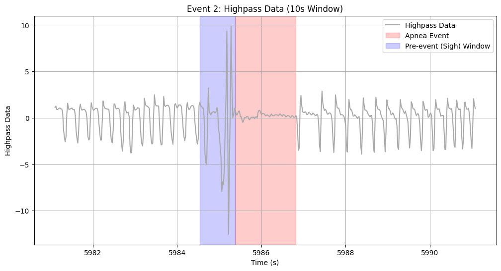
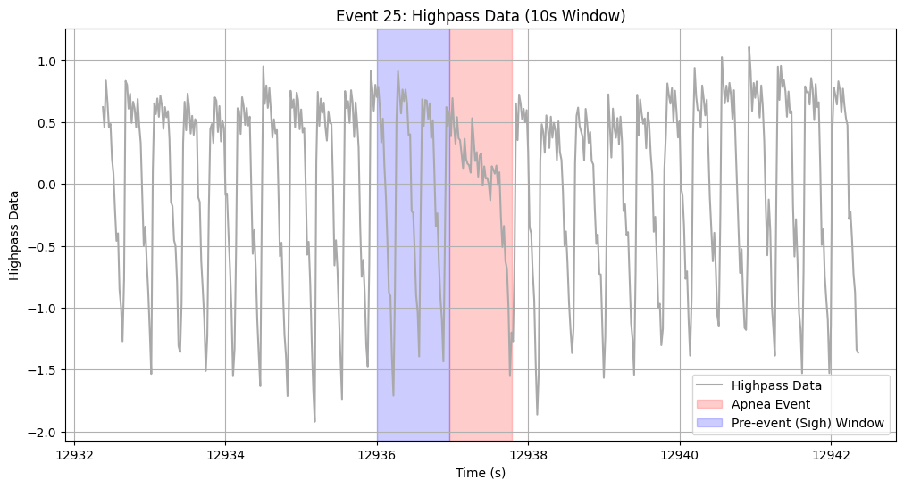

# Automated Apnea Detection in Rodent Respiration Data

## Summary

Developed a robust Python-based pipeline for the automated detection and characterization of respiratory events (apneas) from rodent plethysmography data (EDF files). The system uses signal processing techniques, including dynamic thresholding based on signal derivatives, to accurately identify events in variable physiological data. It significantly reduces analysis time compared to manual scoring (from hours to minutes per file) and facilitates efficient expert review through integrated visualizations and structured data exports.

## Problem & Goal

Analyzing respiratory patterns in rodents (mice, rats) is crucial for basic science research, such as studying apnea models or the effects of treatments. However, manual scoring of respiratory events from lengthy recordings (often hours long) presents significant challenges:

* **Time-Consuming:** Rodent respiration is fast, making manual review extremely laborious.
* **Subjectivity/Consistency:** Manual scoring can suffer from inter-rater variability.
* **Data Volume:** Research labs often generate large volumes of data, creating analysis backlogs.

The primary goals of this project were to:
1.  Develop an automated algorithm to reliably **detect** respiratory events, specifically apneas, in variable plethysmography signals.
2.  **Characterize** detected events with relevant metrics (duration, CV, sigh index) to aid subsequent classification and analysis.
3.  Create a pipeline to process large batches of EDF files **efficiently**, dramatically reducing the time required compared to manual analysis.

## My Role

As the primary developer, I designed and implemented the entire automated analysis pipeline, including the core signal processing algorithms, event detection logic, feature calculation, data visualization, and final report generation using Python.

## Approach & Methodology

The analysis pipeline was implemented as an object-oriented Python class (`ApneaFinder`) for modularity and maintainability, processing EDF files of several hours of duration (around 1 million data points after downsampling).

* **Data Handling:** Reads airflow data directly from EDF files using `mne-python`, calculates the sampling rate, and performs initial preprocessing like downsampling (to 50Hz) and high-pass filtering (`scipy.signal`) to remove baseline drift. Respiratory rate is estimated using `neurokit2`.
* **Core Detection Algorithm:** The key challenge was detecting subtle apnea events within highly variable respiratory signals. The core logic involves:
    1.  **Smoothing:** Applying rolling averages to the filtered airflow signal.
    2.  **Derivative Calculation:** Computing the absolute first derivative of the smoothed signal to quantify the rate of airflow change. Apneas are characterized by periods of very low airflow change.
    3.  **Dynamic Thresholding:** Identifying potential events by finding periods where the derivative falls below a *dynamic threshold*. This threshold is calculated based on the *rolling median* of the derivative in a surrounding window, allowing the algorithm to adapt to baseline shifts and noise variations in the signal over time.
    4.  **Event Filtering & Merging:** Initial events are filtered based on minimum duration (calculated relative to the local respiration rate) and merged if they occur very close together.
* **Event Characterization:** For each valid detected event, several metrics are calculated to aid expert review and potential classification:
    * **Duration:** Length of the low-airflow period.
    * **Coefficient of Variation (CV):** Calculated on the derivative signal within the event. Higher CV helps distinguish noisier hypopneas from flatter apneas.
    * **Sigh Index:** A custom metric developed to quantify the presence of a preceding sigh (large breath), aiding in the identification of Post-Sigh Apneas (PSAs).
    * Other metrics like slope and R² of the airflow signal during the event were also calculated.
* **Visualization & Output:** The pipeline generates visualizations using Matplotlib and Seaborn and exports results:
    * **Per-Event Plots:** Generates plots for each detected event showing raw, filtered, smoothed, and derivative signals, clearly highlighting the event boundaries and pre-event windows.
    * **Excel Summary:** Creates a detailed Excel spreadsheet listing all detected events and their calculated metrics (Duration, CV, Sigh Index, etc.). **Crucially, this report includes clickable hyperlinks directly to the generated plot images for each event**, allowing for extremely rapid expert verification and classification.

Example showing how the derivative (bottom trace) clearly drops during an apnea event identified in the raw airflow signal (top trace).

Demonstration of the custom "Sigh Index" metric effectively increasing with Post-Sigh Apneas

Example showing how the Coefficient of Variation (CV) helps distinguish low-variability apneas from higher-variability hypopneas.

Final Excel report summarizing detected events with calculated metrics and embedded hyperlinks to individual event plots for rapid expert review.

## Results & Impact

* **Algorithm Performance:** The derivative-based detection algorithm with dynamic thresholding proved effective in identifying apnea events consistent with expert visual assessment across variable datasets.
* **Time Savings:** The automated pipeline **reduced the analysis time for a typical multi-hour recording from several hours (manual scoring) to just a few minutes**.
* **Enhanced Review:** The generated Excel reports with integrated plot links significantly streamlined the necessary expert review and classification process.
* **Research Enablement:** Enabled the collaborating research lab (Physiology Lab, UACh) to process a large backlog of experimental data and efficiently analyze results from ongoing studies on rodent respiratory models.

## Technologies Used

* **Core:** Python
* **Data Handling:** Pandas, Numpy
* **Signal Processing:** SciPy (signal), NeuroKit2
* **EDF Handling:** MNE-Python
* **Visualization:** Matplotlib, Seaborn
* **Excel Export:** Openpyxl, Pandas

## Links & Availability

* **Code:** The code repository is private due to the nature of the research collaboration.

